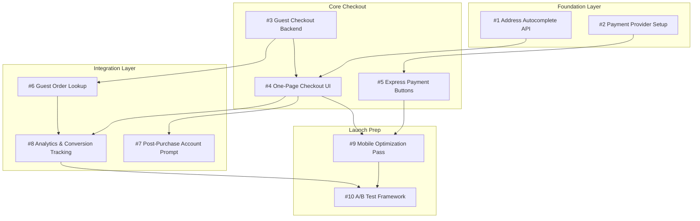

# Checkout Redesign: Spec-to-Issue Pipeline

**Source Spec:** [specs/checkout-redesign.md](/specs/checkout-redesign.md)  
**Created:** February 4, 2026  
**Epic Label:** `epic:checkout-redesign`

---

## Dependency Graph



---

## Issue Templates

### Issue #1: Address Autocomplete API Integration

**Title:** `[Checkout] Integrate Google Places API for address autocomplete`

**Labels:** `backend`, `api`, `epic:checkout-redesign`, `priority:high`

**Estimated Effort:** 3 points (M)

**Dependencies:** None (foundation task)

**Description:**
Integrate Google Places API to provide address autocomplete in checkout form. Reduces form friction and shipping errors.

**Acceptance Criteria:**
- [ ] Google Places API key provisioned and stored in secrets manager
- [ ] Backend proxy endpoint to avoid exposing API key client-side
- [ ] Rate limiting implemented (1000 req/min per session)
- [ ] Fallback to manual entry if API unavailable
- [ ] Address components parsed into shipping fields (street, city, state, zip)
- [ ] Unit tests for address parsing logic

---

### Issue #2: Payment Provider Configuration

**Title:** `[Checkout] Configure Apple Pay & Google Pay merchant accounts`

**Labels:** `backend`, `payments`, `infra`, `epic:checkout-redesign`, `priority:high`

**Estimated Effort:** 2 points (S)

**Dependencies:** None (foundation task)

**Description:**
Complete merchant setup for Apple Pay and Google Pay. PayPal Express already integrated—optimize placement in later issue.

**Acceptance Criteria:**
- [ ] Apple Pay merchant ID registered and verified
- [ ] Google Pay merchant ID configured in Google Pay Console
- [ ] Payment certificates stored securely
- [ ] Domain verification files deployed to production
- [ ] Sandbox/test accounts configured for QA

---

### Issue #3: Guest Checkout Backend Support

**Title:** `[Checkout] Enable order processing without user account`

**Labels:** `backend`, `api`, `database`, `epic:checkout-redesign`, `priority:high`

**Estimated Effort:** 5 points (L)

**Dependencies:** None (can start immediately)

**Description:**
Modify order processing pipeline to support guest orders. Currently requires `user_id` foreign key—need to make nullable and add `guest_email` field for order communication.

**Acceptance Criteria:**
- [ ] Database migration: `orders.user_id` nullable, add `orders.guest_email`
- [ ] Order creation API accepts guest checkout payload
- [ ] Order confirmation email sent to guest email
- [ ] Guest orders visible in admin dashboard with "Guest" badge
- [ ] Fraud scoring adjusted for guest orders (consult Risk team)
- [ ] Integration tests for guest order flow

---

### Issue #4: One-Page Checkout UI Component

**Title:** `[Checkout] Build single-page checkout with progressive disclosure`

**Labels:** `frontend`, `ui`, `epic:checkout-redesign`, `priority:high`

**Estimated Effort:** 8 points (XL)

**Dependencies:** 
- #1 Address Autocomplete API (for address form)
- #3 Guest Checkout Backend (for guest flow)

**Description:**
Replace current 5-step wizard with single scrollable page. Sections: Shipping → Payment → Review. Progressive disclosure collapses completed sections.

**Acceptance Criteria:**
- [ ] Single-page layout with collapsible sections
- [ ] Shipping section with address autocomplete integration
- [ ] Payment section shows saved methods (if logged in) or guest input
- [ ] Real-time order summary sidebar (sticky on desktop, bottom sheet on mobile)
- [ ] Form validation inline, not on submit
- [ ] Skeleton loading states for async data
- [ ] Accessible: WCAG 2.1 AA compliant
- [ ] Design review sign-off

---

### Issue #5: Express Payment Button Integration

**Title:** `[Checkout] Add Apple Pay, Google Pay, and PayPal Express buttons`

**Labels:** `frontend`, `payments`, `epic:checkout-redesign`, `priority:high`

**Estimated Effort:** 5 points (L)

**Dependencies:**
- #2 Payment Provider Setup

**Description:**
Implement express payment buttons at top of checkout page. These skip manual form entry entirely using stored payment/address from wallets.

**Acceptance Criteria:**
- [ ] Apple Pay button renders on supported browsers (Safari, iOS)
- [ ] Google Pay button renders on supported browsers (Chrome, Android)
- [ ] PayPal Express button with updated placement
- [ ] Payment method detection hides unsupported options
- [ ] Express checkout bypasses address form (uses wallet address)
- [ ] Order created via same backend flow as standard checkout
- [ ] Analytics events: `express_payment_started`, `express_payment_completed`

---

### Issue #6: Guest Order Lookup System

**Title:** `[Checkout] Build email-based order lookup for guests`

**Labels:** `frontend`, `backend`, `epic:checkout-redesign`, `priority:medium`

**Estimated Effort:** 3 points (M)

**Dependencies:**
- #3 Guest Checkout Backend

**Description:**
Allow guests to track orders via email + order number. Consider magic link for better UX.

**Acceptance Criteria:**
- [ ] `/orders/lookup` page with email + order number form
- [ ] Magic link option: email one-click link valid for 24 hours
- [ ] Rate limiting on lookup endpoint (prevent enumeration)
- [ ] Order status page shows tracking info, items, delivery estimate
- [ ] Upsell: "Create account to save this order to your history"

---

### Issue #7: Post-Purchase Account Creation Prompt

**Title:** `[Checkout] Prompt guests to create account after purchase`

**Labels:** `frontend`, `growth`, `epic:checkout-redesign`, `priority:medium`

**Estimated Criteria:** 2 points (S)

**Dependencies:**
- #4 One-Page Checkout UI

**Description:**
After successful guest checkout, show account creation prompt on confirmation page. Pre-fill email, require only password. Highlight order history benefit.

**Acceptance Criteria:**
- [ ] Account prompt on order confirmation page (not modal)
- [ ] Email pre-filled from checkout
- [ ] One-field password creation (confirm via email)
- [ ] Guest orders retroactively linked to new account
- [ ] Skip option clearly visible (no dark patterns)
- [ ] Analytics: `post_purchase_signup_shown`, `post_purchase_signup_completed`

---

### Issue #8: Checkout Analytics & Conversion Tracking

**Title:** `[Checkout] Implement funnel analytics for new checkout flow`

**Labels:** `frontend`, `analytics`, `epic:checkout-redesign`, `priority:high`

**Estimated Effort:** 3 points (M)

**Dependencies:**
- #4 One-Page Checkout UI
- #6 Guest Order Lookup (for guest tracking)

**Description:**
Instrument new checkout for conversion funnel analysis. Must support A/B test comparison with old flow.

**Acceptance Criteria:**
- [ ] Events: `checkout_started`, `shipping_completed`, `payment_completed`, `order_placed`
- [ ] Properties: `checkout_version`, `is_guest`, `payment_method`, `has_express_pay`
- [ ] Funnel visualization in analytics dashboard
- [ ] Drop-off alerts if conversion dips >5% from baseline
- [ ] UTM/campaign attribution preserved through guest checkout

---

### Issue #9: Mobile Checkout Optimization

**Title:** `[Checkout] Mobile-specific UX optimizations`

**Labels:** `frontend`, `mobile`, `epic:checkout-redesign`, `priority:high`

**Estimated Effort:** 5 points (L)

**Dependencies:**
- #4 One-Page Checkout UI
- #5 Express Payment Buttons

**Description:**
Optimize checkout for mobile (59% of traffic). Target: close the 23% conversion gap between mobile and desktop.

**Acceptance Criteria:**
- [ ] Touch-friendly form inputs (larger tap targets, proper spacing)
- [ ] Numeric keyboard for phone/zip fields
- [ ] Express pay buttons above fold on mobile
- [ ] Bottom sheet for order summary (not sidebar)
- [ ] Autofill hints for all form fields
- [ ] Performance: <3s Time to Interactive on 4G
- [ ] Test on: iPhone 14, Pixel 7, Galaxy S23

---

### Issue #10: A/B Test Framework Setup

**Title:** `[Checkout] Configure A/B test for new vs old checkout`

**Labels:** `infra`, `analytics`, `epic:checkout-redesign`, `priority:medium`

**Estimated Effort:** 3 points (M)

**Dependencies:**
- #8 Analytics & Conversion Tracking
- #9 Mobile Optimization Pass

**Description:**
Gradual rollout with A/B testing. Start at 10% traffic, scale based on conversion metrics.

**Acceptance Criteria:**
- [ ] Feature flag: `checkout_v2_enabled` with percentage rollout
- [ ] User bucketing is sticky (same user sees same version)
- [ ] Exclude users mid-checkout from experiment switches
- [ ] Dashboard comparing v1 vs v2 conversion rates
- [ ] Statistical significance calculator integrated
- [ ] Kill switch for instant rollback

---

## Summary Table

| # | Title | Labels | Effort | Depends On |
|---|-------|--------|--------|------------|
| 1 | Address Autocomplete API | `backend`, `api` | M (3) | — |
| 2 | Payment Provider Setup | `backend`, `payments`, `infra` | S (2) | — |
| 3 | Guest Checkout Backend | `backend`, `api`, `database` | L (5) | — |
| 4 | One-Page Checkout UI | `frontend`, `ui` | XL (8) | #1, #3 |
| 5 | Express Payment Buttons | `frontend`, `payments` | L (5) | #2 |
| 6 | Guest Order Lookup | `frontend`, `backend` | M (3) | #3 |
| 7 | Post-Purchase Account Prompt | `frontend`, `growth` | S (2) | #4 |
| 8 | Checkout Analytics | `frontend`, `analytics` | M (3) | #4, #6 |
| 9 | Mobile Optimization | `frontend`, `mobile` | L (5) | #4, #5 |
| 10 | A/B Test Framework | `infra`, `analytics` | M (3) | #8, #9 |

**Total Estimated Effort:** 39 points

---

## Agent Automation Instructions

### Auto-Creating Issues via GitHub CLI

```bash
# Prerequisites: gh cli authenticated, in repo root

# Create epic label first
gh label create "epic:checkout-redesign" --color "6f42c1" --description "Checkout Redesign Q1 2026"

# Create Issue #1 (no dependencies)
gh issue create \
  --title "[Checkout] Integrate Google Places API for address autocomplete" \
  --body-file ./roadmap/issue-templates/issues/checkout-01-address-api.md \
  --label "backend,api,epic:checkout-redesign,priority:high"

# After creating all issues, add dependency references via comments:
gh issue comment 4 --body "Blocked by #1 and #3"
```

### Auto-Creating Issues via GitHub MCP

An agent can use the GitHub MCP tools to create these issues programmatically:

```markdown
## Agent Workflow

1. **Read this breakdown file** to understand the structure
2. **Create issues in dependency order:**
   - First: Issues with no dependencies (#1, #2, #3)
   - Then: Issues depending only on foundation (#4, #5, #6)
   - Finally: Integration and polish issues (#7, #8, #9, #10)
3. **For each issue:**
   - Use `mcp_github_issue_write` with method: `create`
   - Include full acceptance criteria in body
   - Apply labels from the template
   - Add dependency note in body: "**Blocked by:** #X, #Y"
4. **After all issues created:**
   - Add issues to project board
   - Set milestone to "Checkout Redesign v2"
```

### JSON Payload Template

```json
{
  "method": "create",
  "owner": "contoso",
  "repo": "product-brain",
  "title": "[Checkout] {ISSUE_TITLE}",
  "body": "## Description\n\n{DESCRIPTION}\n\n## Acceptance Criteria\n\n{CRITERIA}\n\n## Dependencies\n\n{DEPS}\n\n---\n\n**Effort:** {POINTS} points\n**Source:** [Spec](/specs/checkout-redesign.md)",
  "labels": ["{LABELS}"]
}
```

---

## Workflow: Spec → Issues → Project Board


### Checklist for Reuse

When applying this template to other specs:

- [ ] Identify atomic tasks (single engineer, <1 week)
- [ ] Map dependencies—what blocks what?
- [ ] Assign one primary label per layer (frontend/backend/infra)
- [ ] Include measurable acceptance criteria
- [ ] Reference source spec in every issue
- [ ] Create epic label for grouping
- [ ] Estimate using consistent scale (S/M/L/XL or points)

---

*Template maintained by Product Management. Last updated: Feb 4, 2026*
