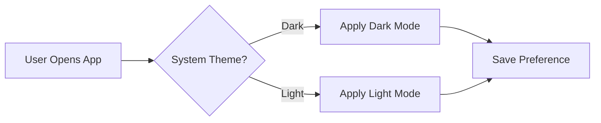

# Plan: Complete GitHub SDLC Demo Solution

This plan creates a fully functional end-to-end demo competing against Atlassian, demonstrating the complete Software Development Lifecycle using GitHub products. The demo follows the **12-act story arc** from [pm-demo-guide.md](specs/demoplan/pm-demo-guide.md), uses the existing Contoso Product Brain repo, and enables live MCP-driven artifact creation.

---

## GitHub Products Demonstrated

| Product | SDLC Phase | Key Capability |
|---------|------------|----------------|
| **GitHub Repos** | Plan, Design | Markdown specs, ADRs, version history |
| **GitHub Issues** | Plan, Develop | Work tracking, linked to PRs |
| **GitHub Projects** | Plan, Track | Table, Board, Roadmap views; Insights |
| **GitHub Copilot Chat** | All phases | Context-aware AI assistance |
| **GitHub Copilot Spaces** | Plan | Curated context for grounded queries |
| **GitHub Copilot Code Review** | Develop | AI-powered PR review |
| **GitHub Copilot Coding Agent** | Develop | Autonomous issue resolution |
| **GitHub Copilot Hooks** | All phases | postToolUse automation, TOC regeneration |
| **GitHub Copilot Autofix** | Secure | Security vulnerability remediation |
| **GitHub MCP** | Plan → Execute | Plan markdown → GitHub artifacts |
| **GitHub Actions** | All phases | CI/CD, **doc generation**, automation |
| **GitHub Advanced Security** | Secure | Dependabot, CodeQL, Secret Scanning |
| **GitHub Releases** | Deploy | Auto-generated changelogs |
| **GitHub Pages** | Operate | Documentation hosting (optional) |
| **GitHub Environments** | Deploy | Staging/production approvals |

---

## Confluence Parity: Documentation Management

**This is a core differentiator.** Confluence is used throughout the SDLC for specs, decisions, and knowledge management. GitHub replaces it with:

| Confluence Feature | GitHub Equivalent | Automation |
|--------------------|-------------------|------------|
| Spaces & page trees | Folders + README TOC | Actions + **Copilot Hooks** update TOC |
| Page creation | Markdown files | Copilot drafts via MCP |
| Rich content | Mermaid, images, tables | Native markdown rendering |
| Search/discovery | Copilot Spaces + `@workspace` | Semantic search |
| Publishing | HTML summaries in repo | Actions generates HTML |
| Comments & review | PR-based review | Approval workflow |
| Version history | Git history | Full audit trail |
| Permissions | Branch protection + CODEOWNERS | Granular access |
| Real-time sync | postToolUse hooks | TOC regenerates on every Copilot edit |

### Documentation Workflow (Actions-Based)

```
┌─────────────────────────┐       ┌─────────────────────────┐
│ 1. Create/Edit Markdown │──────▶│ 2. Commit to Branch     │
│    specs/feature.md     │       │    (or via MCP)         │
└─────────────────────────┘       └───────────┬─────────────┘
                                              │
                                              ▼
                                  ┌─────────────────────────┐
                                  │ 3. PR Review & Approve  │
                                  │    (Confluence = none)  │
                                  └───────────┬─────────────┘
                                              │
                                              ▼
                          ┌───────────────────┴───────────────────┐
                          │                                       │
              ┌───────────▼───────────┐           ┌───────────────▼───────────┐
              │ 4a. Generate HTML     │           │ 4b. Update README TOC     │
              │     Summary           │           │     with new links        │
              └───────────┬───────────┘           └───────────────┬───────────┘
                          │                                       │
                          └───────────────────┬───────────────────┘
                                              ▼
                                  ┌─────────────────────────┐
                                  │ 5. Commit Generated     │
                                  │    Files to Repo        │
                                  └─────────────────────────┘
```

### Documentation Actions Workflow

```yaml
# .github/workflows/docs-publish.yml
name: Generate Documentation

on:
  push:
    branches: [main]
    paths:
      - 'specs/**/*.md'
      - 'insights/**/*.md'
      - 'research/**/*.md'
  workflow_dispatch:

jobs:
  generate-docs:
    runs-on: ubuntu-latest
    permissions:
      contents: write
    steps:
      - uses: actions/checkout@v4

      - name: Generate HTML Summaries
        run: |
          # For each spec, generate email-safe HTML
          for file in specs/**/*.md; do
            output="${file%.md}.html"
            # Use pandoc or custom script to convert
            pandoc "$file" -o "$output" --standalone --metadata title="$(basename $file .md)"
          done

      - name: Update README TOC
        run: |
          echo "## Documentation" > docs-toc.md
          echo "" >> docs-toc.md
          echo "### Specifications" >> docs-toc.md
          for file in specs/*.md; do
            title=$(head -1 "$file" | sed 's/# //')
            echo "- [$title]($file)" >> docs-toc.md
          done
          echo "" >> docs-toc.md
          echo "### Insights" >> docs-toc.md
          for file in insights/*.md; do
            title=$(head -1 "$file" | sed 's/# //')
            echo "- [$title]($file)" >> docs-toc.md
          done
          # Inject into README.md

      - name: Commit Generated Files
        uses: stefanzweifel/git-auto-commit-action@v5
        with:
          commit_message: "docs: Auto-generate HTML summaries and update TOC"
          file_pattern: "**/*.html README.md"
```

### Demo Points for Confluence Parity

| Confluence Action | Demo in GitHub |
|-------------------|----------------|
| "Create a new spec page" | Create `specs/dark-mode.md` via Copilot |
| "Navigate to spec" | Click link in README TOC |
| "Search for topic" | Use Copilot Spaces: "What specs mention payments?" |
| "See page history" | Git history: `git log specs/dark-mode.md` |
| "Approve changes" | PR approval workflow |
| "Share with stakeholder" | Send HTML file or repo link |

---

## Demo Acts (12 Total)

| Act | Title | Key Demo | GitHub Products | Persona |
|-----|-------|----------|-----------------|--------|
| **0** | Explore the Knowledge | Query existing context | Copilot Spaces | PM |
| **1** | The Idea (PRD Creation) | Write spec in repo | Repos + Copilot Chat | PM |
| **1.5** | Analyze Data | Create visualizations | Copilot + Python | PM, Data |
| **2** | The Breakdown | PRD → Issues | **GitHub MCP + Issues** | PM |
| **2.5** | Build the Prototype | Scaffold HTML demo | Copilot Coding Agent | PM, Dev |
| **2.75** | Challenge the Thinking | Stress-test approach | Copilot (Design Partner prompt) | PM |
| **3** | Sprint Planning | Organize work | Projects (Table, Board, Roadmap) | PM, Dev |
| **4** | Daily Standup | Track progress | Projects Board view | Dev, QA |
| **5** | Blockers & Dependencies | Resolve issues | Issue links, cross-repo refs | Dev, PM |
| **6** | Leadership Reporting | Executive metrics | Projects Insights + API | Leadership |
| **7** | Ship It | Deploy feature | Actions + Environments | DevOps, Release |
| **8** | Release Documentation | Release notes + docs sync | Releases + Actions | Tech Writer |

---

## Phase 1: PLAN (Acts 0-2)

### Act 0: Explore the Knowledge

**Objective:** Show Copilot Spaces querying curated product context

**Pre-requisites:**
- [ ] Create Copilot Space named "Product Brain"
- [ ] Include: `specs/`, `insights/`, `research/`, recent PRs
- [ ] Verify Space is shared with demo account

**Demo Artifacts:**
| Artifact | Location | Purpose |
|----------|----------|---------|
| Copilot Space | GitHub.com | Curated context collection |
| Query examples | [specs/demoplan/copilot-queries.md](specs/demoplan/) | Sample prompts to use |

**Demo Script:**
```
"What do we know about customer sustainability preferences?"
"Summarize the insights from our Q4 feedback analysis"
"What specs reference the checkout flow?"
```

**Fallback:** If Copilot Spaces unavailable, use Copilot Chat with `@workspace` in VS Code

---

### Act 1: The Idea (PRD Creation)

**Objective:** Write a PRD in markdown, show real-time collaboration, add Mermaid diagram

**Pre-requisites:**
- [ ] PRD template exists at `.github/templates/prd-template.md`
- [ ] VS Code with Copilot extension installed
- [ ] Mermaid preview extension enabled

**Demo Artifacts:**
| Artifact | Location | Purpose |
|----------|----------|---------|
| PRD Template | [.github/templates/prd-template.md](.github/templates/) | Starting point for new specs |
| Sample PRD | [specs/checkout-redesign.md](specs/checkout-redesign.md) | Existing spec to demo with |
| New PRD | `specs/dark-mode.md` | Create live during demo |

**Mermaid Diagram to Create:**


**Copilot Prompts:**
- "Draft a PRD for dark mode support based on our checkout-redesign template"
- "Generate a Mermaid diagram showing the user flow"
- "What technical risks should I include based on our codebase?"

---

### Act 1.5: Analyze Data

**Objective:** Use Copilot to analyze customer data and create Power BI visualizations

**Pre-requisites:**
- [ ] Python environment with pandas, matplotlib
- [ ] Sample data at [research/data/customer-survey-2025.csv](research/data/)
- [ ] Jupyter notebook capability in VS Code

**Demo Artifacts:**
| Artifact | Location | Purpose |
|----------|----------|---------|
| Analysis script | [analysis/scripts/survey-analysis.py](analysis/scripts/) | Python analysis example |
| DAX queries | [analysis/powerbi/dax-examples.md](analysis/powerbi/) | Power BI formulas |
| Sample notebook | [analysis/notebooks/customer-nps-analysis-q4-2025.ipynb](analysis/notebooks/) | Interactive analysis |

**Copilot Prompts:**
- "Analyze survey-2025.csv and show top 5 feature requests by frequency"
- "Generate a DAX measure for calculating NPS by customer segment"
- "Create a Python visualization showing abandonment rate trends"

---

### Act 2: The Breakdown (PRD → Issues → Project)

**Objective:** Use GitHub MCP to create Issues from PRD markdown. Issues automatically flow into the Project via GitHub Actions workflow.

**How It Works:**

```
┌─────────────────────┐     ┌─────────────────────┐     ┌─────────────────────┐
│  1. PRD Markdown    │────▶│  2. Copilot + MCP   │────▶│  3. Issues Created  │
│  specs/checkout.md  │     │  issue_write tool   │     │  with labels        │
└─────────────────────┘     └─────────────────────┘     └──────────┬──────────┘
                                                                   │
                                                                   │ Triggers
                                                                   ▼
                                                      ┌────────────────────────┐
                                                      │  4. Auto-Add Workflow  │
                                                      │  .github/workflows/    │
                                                      │  auto-add-to-project   │
                                                      └──────────┬─────────────┘
                                                                 │
                                                                 ▼
                                                      ┌────────────────────────┐
                                                      │  5. Project Board      │
                                                      │  Issues appear in      │
                                                      │  Sprint backlog        │
                                                      └────────────────────────┘
```

**Key Point:** MCP creates Issues → Labels trigger workflow → Workflow adds to Project

**MCP Capabilities:**
| Operation | MCP Tool | Status |
|-----------|----------|--------|
| Create Issues | `mcp_io_github_git_issue_write` | ✅ Supported |
| List Issues | `mcp_io_github_git_list_issues` | ✅ Supported |
| Create sub-issues | `mcp_io_github_git_sub_issue_write` | ✅ Supported |
| Assign Copilot to Issue | `mcp_io_github_git_assign_copilot_to_issue` | ✅ Supported |
| Add Issues to Project | — | ❌ Use workflow instead |

---

### Pre-requisites

- [ ] GitHub MCP server configured in VS Code
- [ ] GitHub Project already created ("SDLC Demo - Checkout Redesign")
- [ ] Auto-add workflow deployed to repository
- [ ] `PROJECT_TOKEN` secret configured with project access

---

### Step 1: Deploy Auto-Add Workflow

Create `.github/workflows/auto-add-to-project.yml`:

```yaml
name: Auto-add Issues to Project

on:
  issues:
    types: [opened, labeled]

jobs:
  add-to-project:
    name: Add issue to project
    runs-on: ubuntu-latest
    steps:
      - name: Add to Project
        uses: actions/add-to-project@v1.0.2
        with:
          # Update with your project URL
          project-url: https://github.com/orgs/contoso/projects/1
          github-token: ${{ secrets.PROJECT_TOKEN }}
          # Issues with these labels will be added
          labeled: checkout, enhancement, epic
```

**Required Secret:**
| Secret | Scopes | Where to Create |
|--------|--------|-----------------|
| `PROJECT_TOKEN` | `repo`, `project`, `read:org` | Repo → Settings → Secrets → Actions |

---

### Step 2: Configure MCP in VS Code

```json
// VS Code mcp.json
{
  "servers": {
    "github": {
      "type": "http",
      "url": "https://api.githubcopilot.com/mcp/"
    }
  }
}
```

---

### Step 3: Create Issues via Copilot + MCP

**Copilot Prompt:**
```
Read specs/checkout-redesign.md and create GitHub Issues for each requirement
in the 'Proposed Solution' section. For each issue:
- Use title format: '[Checkout] <feature name>'
- Include acceptance criteria from the spec
- Add labels: enhancement, checkout
- Link back to the spec file in the issue body
Repository: contoso/product-brain
```

**What Happens:**
1. Copilot reads the spec
2. Copilot calls `mcp_io_github_git_issue_write` for each requirement
3. Each Issue is created with `checkout` label
4. Auto-add workflow triggers on each `issues.opened` event
5. Issues appear in Project board automatically

**For Epic/Sub-Issues:**
```
"Create a parent issue 'Express Payment Integration' with label 'epic',
then add sub-issues for Apple Pay, Google Pay, and PayPal optimization"
```

---

### Expected Issues Created

| # | Title | Labels | Parent |
|---|-------|--------|--------|
| 1 | [Checkout] One-page checkout layout | `enhancement`, `frontend`, `checkout` | — |
| 2 | [Checkout] Guest checkout as default | `enhancement`, `checkout` | — |
| 3 | [Checkout] Express Payment Integration | `epic`, `payments`, `checkout` | — |
| 4 | [Checkout] Apple Pay integration | `enhancement`, `payments` | #3 |
| 5 | [Checkout] Google Pay integration | `enhancement`, `payments` | #3 |
| 6 | [Checkout] PayPal Express optimization | `enhancement`, `payments` | #3 |
| 7 | [Checkout] Address autocomplete | `enhancement`, `frontend`, `checkout` | — |
| 8 | [Checkout] Guest order tracking | `enhancement`, `backend`, `checkout` | — |
| 9 | [Checkout] Mobile checkout optimization | `enhancement`, `mobile`, `checkout` | — |
| 10 | [Checkout] Checkout analytics events | `enhancement`, `analytics`, `checkout` | — |

---

### Demo Artifacts

| Artifact | Location | Purpose |
|----------|----------|---------|
| Auto-add workflow | [.github/workflows/auto-add-to-project.yml](.github/workflows/) | **Required** — Bridges MCP to Project |
| MCP setup guide | [specs/demoplan/mcp-setup.md](specs/demoplan/) | Configuration instructions |
| Issue template | [.github/ISSUE_TEMPLATE/feature.yml](.github/ISSUE_TEMPLATE/) | Structured issue format |
| Prompt templates | [specs/demoplan/mcp-prompts.md](specs/demoplan/) | Copilot prompts for MCP |

---

### Demo Flow for Act 2

| Step | Action | What Audience Sees |
|------|--------|-------------------|
| 1 | Open `specs/checkout-redesign.md` in VS Code | PRD with requirements |
| 2 | Invoke Copilot with prompt | Copilot reads spec |
| 3 | Watch Copilot call MCP | Issues being created (terminal output) |
| 4 | Switch to GitHub browser | New Issues in Issues tab |
| 5 | Open Actions tab | Auto-add workflow runs triggered |
| 6 | Open Project board | Issues appearing in backlog |

**Timing:** ~3-5 minutes

**Fallback:** Pre-staged Issues and Project if MCP/workflow unavailable

---

## Phase 2: DESIGN (Acts 2.5-2.75)

### Act 2.5: Build the Prototype

**Objective:** Use Copilot Coding Agent / Scaffold Agent to create working HTML prototype

**Pre-requisites:**
- [ ] Prototype template exists (reuse from `prototypes/checkout-mockup/`)
- [ ] Design system tokens documented in [AGENTS.md](AGENTS.md)
- [ ] Copilot Agent mode enabled

**Demo Artifacts:**
| Artifact | Location | Purpose |
|----------|----------|---------|
| Dark mode prototype | [prototypes/dark-mode/index.html](prototypes/dark-mode/) | Output of scaffolding |
| Design system | [AGENTS.md](AGENTS.md) | Color tokens, typography |
| Existing prototype | [prototypes/checkout-mockup/](prototypes/checkout-mockup/) | Pattern reference |

**Copilot Prompt:**
```
Create a prototype in prototypes/dark-mode/index.html that demonstrates
dark mode toggle functionality. Use our design system from AGENTS.md:
- Dark base: #0a0c0a
- Card bg: rgba(17, 20, 17, 0.85)
- Forest accent: #4ade80
- Typography: Outfit for body, Source Serif 4 for display
Include a toggle switch that saves preference to localStorage.
```

**Design System CSS (from AGENTS.md):**
```css
.glass-card {
  background: rgba(17, 20, 17, 0.85);
  border: 1px solid rgba(163, 171, 163, 0.12);
  backdrop-filter: blur(20px);
  border-radius: 16px;
}
```

---

### Act 2.75: Challenge the Thinking

**Objective:** Use Copilot as a "Design Partner" to stress-test the approach

**Pre-requisites:**
- [ ] Design Partner prompt configured
- [ ] Current spec open in editor

**Design Partner System Prompt:**
```markdown
You are a critical design partner. Your role is to:
1. Find edge cases the spec doesn't address
2. Question assumptions about user behavior
3. Identify technical risks not mentioned
4. Suggest competitive disadvantages
5. Ask "What if we're wrong about X?"

Be constructive but challenging. Push back on vague requirements.
```

**Demo Prompts:**
- "Challenge the assumptions in this checkout redesign spec"
- "What edge cases might break our guest checkout flow?"
- "How would a competitor attack our solution?"

---

## Phase 3: DEVELOP (Acts 3-5)

### Act 3: Sprint Planning

**Objective:** Show GitHub Projects Table, Board, and Roadmap views

**Pre-requisites:**
- [ ] GitHub Project created with Issues from Act 2
- [ ] Custom fields configured (see below)
- [ ] Views configured: Table, Board, Roadmap

**Project Configuration:**
| Custom Field | Type | Options |
|--------------|------|---------|
| Sprint | Iteration | Sprint 1, Sprint 2, Sprint 3 |
| Story Points | Number | — |
| Persona | Single Select | PM, Developer, QA, Security, DevOps |
| SDLC Phase | Single Select | Plan, Design, Develop, Test, Deploy |
| Priority | Single Select | P0, P1, P2, P3 |

**Views to Configure:**
| View | Configuration |
|------|--------------|
| **Backlog (Table)** | Group by: None, Sort by: Priority |
| **Sprint Board** | Group by: Status, Filter: Sprint = current |
| **Roadmap** | Layout: Timeline, Group by: Milestone |

**Demo Actions:**
1. Show Table view → drag issues to prioritize
2. Switch to Board view → move issue to "In Progress"
3. Switch to Roadmap view → show dates and dependencies
4. Filter by Persona to show "what does QA own?"

---

### Act 4: Daily Standup

**Objective:** Show Board view for quick status, demonstrate automation

**Pre-requisites:**
- [ ] Board view with Status column (Todo, In Progress, In Review, Done)
- [ ] Project automation: "PR merged → Issue to Done"

**Demo Actions:**
1. Open Board view filtered to current sprint
2. Show issue card details (assignee, story points, linked PRs)
3. Demonstrate drag-drop status change
4. Show auto-update when PR merged (use pre-staged example)

---

### Act 5: Blockers & Dependencies

**Objective:** Show issue linking, cross-repo references, sub-issues

**Pre-requisites:**
- [ ] Issues with `blocked by #X` syntax
- [ ] Sub-issues created for complex tasks
- [ ] Cross-repo reference if applicable

**Demo Artifacts:**
| Feature | Example |
|---------|---------|
| Blocker link | "Blocked by #42 (Payment API rate limits)" |
| Sub-issues | Parent: "Express payments" → Children: Apple Pay, Google Pay, PayPal |
| Cross-repo | "Depends on contoso/payments-api#15" |

**Copilot Prompt:**
- "What issues are blocking checkout-redesign progress?"
- "Show me the dependency graph for the express payments epic"

---

## Phase 4: TEST & SECURE (implicit in workflow)

### Security Demo (integrated into Acts 3-7)

**Objective:** Show GitHub Advanced Security features during development

**Pre-requisites:**
- [ ] Dependabot enabled on repo
- [ ] Secret scanning with push protection enabled
- [ ] CodeQL analysis configured

**Demo Artifacts:**
| Feature | Demo Point |
|---------|-----------|
| Dependabot | Show PR with dependency update, Copilot explains impact |
| Secret Scanning | Attempt to push a fake API key, show block |
| CodeQL | Show security alert, demonstrate Copilot Autofix |

**Copilot Prompts:**
- "Explain this Dependabot PR and any breaking changes"
- "What's the impact of CVE-2026-1234 on our codebase?"

---

## Phase 5: DEPLOY (Acts 6-7)

### Act 6: Leadership Reporting

**Objective:** Show Projects Insights and API-powered dashboards

**Pre-requisites:**
- [ ] Projects Insights enabled (Enterprise feature)
- [ ] Power BI dashboard connected (optional)
- [ ] HTML dashboard in repo as fallback

**Demo Artifacts:**
| Artifact | Location | Purpose |
|----------|----------|---------|
| Projects Insights | GitHub.com | Native charts and metrics |
| Power BI DAX | [analysis/powerbi/dax-examples.md](analysis/powerbi/) | DAX measures for GitHub data |
| HTML dashboard | [analysis/dashboards/engineering-metrics.html](analysis/dashboards/) | Version-controlled metrics |

**Metrics to Show:**
- Sprint velocity (story points completed)
- Cycle time (Issue created → PR merged)
- Open vs closed issues
- PR review turnaround time

**Copilot Prompt:**
- "What's our velocity trend for the last 3 sprints?"
- "Which features are at risk for the Q1 deadline?"

---

### Act 7: Ship It

**Objective:** Show GitHub Actions CI/CD with environment approvals

**Pre-requisites:**
- [ ] `.github/workflows/ci.yml` — test and build
- [ ] `.github/workflows/deploy.yml` — deploy to staging/production
- [ ] Environment protection rules configured

**Demo Artifacts:**
| Artifact | Location | Purpose |
|----------|----------|---------|
| CI workflow | [.github/workflows/ci.yml](.github/workflows/) | Test on PR |
| Deploy workflow | [.github/workflows/deploy.yml](.github/workflows/) | Deploy with approvals |
| Environment: staging | GitHub Settings | Auto-deploy |
| Environment: production | GitHub Settings | Required approvers |

**Workflow Configuration:**
```yaml
# .github/workflows/deploy.yml
name: Deploy
on:
  push:
    branches: [main]

jobs:
  deploy-staging:
    runs-on: ubuntu-latest
    environment: staging
    steps:
      - uses: actions/checkout@v4
      - name: Deploy to staging
        run: echo "Deployed to staging"

  deploy-production:
    needs: deploy-staging
    runs-on: ubuntu-latest
    environment: production  # Requires approval
    steps:
      - uses: actions/checkout@v4
      - name: Deploy to production
        run: echo "Deployed to production"
```

**Demo Actions:**
1. Merge PR to main → show Actions run
2. Show staging deploy (auto)
3. Show production waiting for approval
4. Approve → show deploy complete
5. Show issue auto-closed with deployment comment

---

## Phase 6: OPERATE (Act 8)

### Act 8: Release Documentation

**Objective:** Generate release notes, verify documentation is up to date

> **Note:** Ongoing documentation (specs, ADRs, insights) is managed continuously via the `docs-publish.yml` workflow from the Confluence Parity section. Act 8 focuses on **release documentation**.

**Pre-requisites:**
- [ ] Merged PRs with conventional commit messages
- [ ] Release template configured
- [ ] docs-publish workflow active (verifies README TOC is current)

**Demo Artifacts:**
| Artifact | Location | Purpose |
|----------|----------|---------|
| Release template | [.github/release.yml](.github/) | Auto-generated categories |
| Updated README TOC | README.md | Auto-updated by docs-publish workflow |
| HTML summaries | `specs/*.html` | Email-safe documentation |

**Copilot Prompts:**
- "Generate release notes for v2.3.0 from merged PRs since v2.2.0"
- "Summarize these changes for non-technical stakeholders"
- "Create a user guide for the new dark mode feature"

**Release Categories:**
```yaml
# .github/release.yml
changelog:
  categories:
    - title: "🚀 Features"
      labels: ["enhancement"]
    - title: "🐛 Bug Fixes"
      labels: ["bug"]
    - title: "🔒 Security"
      labels: ["security"]
```

---

## Workstream 1: Repository Artifacts

### Files to Create

| File | Purpose | Priority |
|------|---------|----------|
| `.github/templates/prd-template.md` | PRD starting point | High |
| `.github/ISSUE_TEMPLATE/feature.yml` | Structured feature request | High |
| `.github/ISSUE_TEMPLATE/bug.yml` | Bug report template | Medium |
| `.github/workflows/ci.yml` | Test and build | High |
| `.github/workflows/deploy.yml` | Deploy with environments | High |
| `.github/workflows/auto-add-to-project.yml` | **Required** — Auto-add labeled issues to Project | **Critical** |
| `.github/workflows/docs-publish.yml` | **Required** — Generate HTML + update README TOC | **Critical** |
| `.github/hooks/docs-automation.json` | **New** — postToolUse hook for TOC regeneration | High |
| `.github/hooks/scripts/regenerate-toc.sh` | Bash script for TOC generation | High |
| `.github/hooks/scripts/regenerate-toc.ps1` | PowerShell script for TOC generation | High |
| `.github/release.yml` | Release note categories | Medium |
| `analysis/scripts/survey-analysis.py` | Data analysis example | Medium |
| `analysis/powerbi/dax-examples.md` | DAX measures | Medium |
| `specs/demoplan/mcp-setup.md` | MCP configuration guide | High |
| `specs/demoplan/mcp-prompts.md` | Copilot prompt templates | High |
| `specs/demoplan/copilot-queries.md` | Spaces query examples | Medium |
| `specs/dark-mode.md` | Demo PRD to create live | High |
| `prototypes/dark-mode/index.html` | Scaffold output placeholder | High |

### Auto-Add to Project Workflow (Critical for Act 2)

This workflow is **required** for the MCP → Project flow. When MCP creates Issues with labels, this workflow automatically adds them to the Project board.

```yaml
# .github/workflows/auto-add-to-project.yml
name: Auto-add Issues to Project

on:
  issues:
    types: [opened, labeled]

env:
  # Update with your actual project URL
  PROJECT_URL: https://github.com/orgs/contoso/projects/1

jobs:
  add-to-project:
    name: Add issue to project
    runs-on: ubuntu-latest
    steps:
      - name: Add to Project
        uses: actions/add-to-project@v1.0.2
        with:
          project-url: ${{ env.PROJECT_URL }}
          github-token: ${{ secrets.PROJECT_TOKEN }}
          # Issues with ANY of these labels will be added
          labeled: checkout, enhancement, epic
```

**Why This Workflow:**
- GitHub MCP cannot directly add Issues to Projects
- This workflow bridges the gap automatically
- Labels act as the trigger — MCP sets labels, workflow adds to Project
- No manual intervention required during demo

### Copilot Hooks for Documentation Automation

Copilot hooks extend agent behavior by executing shell commands at key points during Copilot sessions. The `postToolUse` hook triggers TOC regeneration whenever Copilot edits a spec, insight, or research file.

**Hook Configuration:** `.github/hooks/docs-automation.json`

```json
{
  "version": 1,
  "hooks": {
    "postToolUse": [
      {
        "type": "command",
        "bash": "./.github/hooks/scripts/regenerate-toc.sh",
        "powershell": "./.github/hooks/scripts/regenerate-toc.ps1",
        "cwd": ".",
        "timeoutSec": 30,
        "comment": "Regenerate README TOC when Copilot edits spec/insight files"
      }
    ]
  }
}
```

**How It Works:**

```
┌─────────────────────────┐     ┌─────────────────────────┐     ┌─────────────────────────┐
│  1. Copilot edits       │────▶│  2. postToolUse hook    │────▶│  3. TOC regenerated     │
│  specs/feature.md       │     │  fires automatically    │     │  docs-toc.md updated    │
└─────────────────────────┘     └─────────────────────────┘     └─────────────────────────┘
```

**Script Logic:**
1. Reads tool execution details from stdin (JSON)
2. Checks if operation was successful edit/create
3. Validates file is in `specs/`, `insights/`, or `research/`
4. Regenerates `docs-toc.md` with current file listing
5. Logs action to `logs/docs-automation.log`

**Demo Points:**
| Confluence Action | GitHub + Hooks |
|-------------------|----------------|
| "Page tree auto-updates" | TOC regenerates on every Copilot edit |
| "No manual refresh needed" | Hook runs automatically after tool use |
| "Audit trail" | All regenerations logged with timestamps |

**Efficiency Gain:** Eliminates manual TOC maintenance — documentation stays current as Copilot works.

---

## Workstream 2: GitHub Configuration

### Repository Settings

| Setting | Configuration | Purpose |
|---------|--------------|---------|
| Branch protection | Require PR, 1 approval, status checks | Demo governance |
| Environments | staging (auto), production (approval) | Demo CI/CD |
| Dependabot | Enabled for npm, pip, Actions | Demo security |
| Secret Scanning | Enabled with push protection | Demo security |
| CodeQL | JavaScript, Python | Demo security |
| Issues | Enabled with templates | Demo planning |
| Projects | At least 1 project linked | Demo planning |
| Wiki | Enabled | Demo documentation |
| Pages | Enabled (from docs/ or gh-pages) | Demo hosting |

### Repository Secrets

| Secret | Purpose | Scopes Required |
|--------|---------|-----------------|
| `PROJECT_TOKEN` | Auto-add workflow → Project access | `repo`, `project`, `read:org` |
| `POWERBI_PUSH_URL` | (Optional) Push metrics to Power BI | — |

**Creating PROJECT_TOKEN:**
```
1. GitHub → Settings → Developer settings → Personal access tokens → Fine-grained
2. Repository access: Select your demo repo
3. Permissions:
   - Repository: Issues (Read and write), Metadata (Read)
   - Organization: Projects (Read and write)
4. Generate → Copy token
5. Repo → Settings → Secrets → Actions → New: PROJECT_TOKEN = <token>
```

### GitHub Project Configuration

**Project Name:** "SDLC Demo - Checkout Redesign"

**Fields:**
| Field | Type | Values |
|-------|------|--------|
| Status | Single Select | 📋 Todo, 🔄 In Progress, 👀 In Review, ✅ Done |
| Sprint | Iteration | Sprint 1 (2 weeks), Sprint 2, Sprint 3 |
| Priority | Single Select | 🔴 P0, 🟠 P1, 🟡 P2, 🟢 P3 |
| Story Points | Number | — |
| Persona | Single Select | PM, Developer, QA, Security, DevOps, Release |
| SDLC Phase | Single Select | Plan, Design, Develop, Test, Secure, Deploy |

**Views:**
1. **Backlog** — Table, no grouping, sort by Priority
2. **Sprint Board** — Board, group by Status, filter Sprint = current
3. **Roadmap** — Roadmap layout, group by Milestone
4. **By Persona** — Table, group by Persona

**Automation:**
- Item added → Set Status to Todo
- PR merged → Set Status to Done
- Issue closed → Archive item

### Pre-Staged Issues

Create 8-10 issues from [specs/checkout-redesign.md](specs/checkout-redesign.md):

| # | Title | Labels | Story Points |
|---|-------|--------|--------------|
| 1 | One-page checkout layout | `enhancement`, `frontend` | 8 |
| 2 | Guest checkout as default | `enhancement`, `checkout` | 5 |
| 3 | Apple Pay integration | `enhancement`, `payments` | 8 |
| 4 | Google Pay integration | `enhancement`, `payments` | 8 |
| 5 | PayPal Express optimization | `enhancement`, `payments` | 3 |
| 6 | Address autocomplete API | `enhancement`, `frontend` | 5 |
| 7 | Guest order lookup flow | `enhancement`, `backend` | 5 |
| 8 | Mobile checkout optimization | `enhancement`, `mobile` | 8 |
| 9 | Checkout analytics events | `enhancement`, `analytics` | 3 |
| 10 | Accessibility audit - checkout | `accessibility`, `qa` | 3 |

---

## Workstream 3: Demo Environment

### VS Code Configuration

**Required Extensions:**
- GitHub Copilot
- GitHub Copilot Chat
- GitHub Pull Requests and Issues
- Mermaid Markdown Syntax Highlighting
- Python (for analysis)

**Settings (settings.json):**
```json
{
  "github.copilot.chat.agent.enabled": true,
  "markdown.preview.autoShowPreviewToSide": true
}
```

### Copilot Spaces Setup

1. Create Space: "Product Brain"
2. Add sources:
   - Repository: `contoso/product-brain` (or current repo)
   - Folders: `specs/`, `insights/`, `research/`
   - Recent PRs: Last 30 days
3. Share with demo account
4. Verify queries return expected results

---

## Workstream 4: Speaker Materials

### Files to Create

| File | Purpose |
|------|---------|
| `specs/demoplan/speaker-notes.md` | Per-act talk track with timing |
| `specs/demoplan/demo-checklist.md` | Pre-demo environment verification |
| `specs/demoplan/fallback-guide.md` | What to do when things fail |
| `specs/demoplan/persona-cards.md` | Quick reference for 8 personas |

### Speaker Notes Structure

```markdown
## Act 0: Explore the Knowledge (3-5 min)

### Setup
- Open GitHub.com → Copilot Spaces
- Have "Product Brain" space selected

### Talk Track
"Before I write anything new, I check what we already know.
This is Copilot Spaces—a curated collection of context that grounds AI responses..."

### Key Points
- Spaces persist beyond chat sessions
- Shared with team
- Auto-updates as sources change

### Transition to Act 1
"Now that I know what exists, let me write a new spec..."

### Fallback
If Spaces unavailable: Use VS Code + @workspace + open specs folder
```

### Demo Checklist

```markdown
## 30 Minutes Before Demo

### Environment
- [ ] VS Code open with no other projects
- [ ] GitHub Copilot signed in (check bottom-right icon)
- [ ] MCP server connected (check status bar)
- [ ] Terminal clear of sensitive info
- [ ] Browser signed into GitHub with demo account

### Repository State
- [ ] Main branch clean
- [ ] No pending PRs (unless intentional)
- [ ] Project exists with pre-staged issues
- [ ] Actions workflows passing (green)

### Copilot Spaces
- [ ] "Product Brain" space accessible
- [ ] Test query returns results

### Fallback Ready
- [ ] Pre-staged issues visible
- [ ] Screenshot of each demo step saved
- [ ] Offline version of pm-demo.html available
```

---

## Workstream 5: Prototypes & Visualization

### Interactive Demo Prototype

Create [prototypes/sdlc-demo/index.html](prototypes/sdlc-demo/) showing 12-act flow:
- Reuse glass card pattern from [prototypes/demo-narrative/](prototypes/demo-narrative/)
- Reuse navigation from [prototypes/agentic-pm-talk/](prototypes/agentic-pm-talk/)
- Each act is a "slide" with:
  - Act number and title
  - GitHub products used (icons)
  - Key demo action
  - Screenshot/mockup placeholder
- Navigation: Previous/Next + act picker

### Dark Mode Prototype (Scaffold Output)

Create [prototypes/dark-mode/index.html](prototypes/dark-mode/):
- Simple Contoso-branded page
- Dark/Light mode toggle
- Saves preference to localStorage
- Uses design system from AGENTS.md
- This is the "output" of Act 2.5 scaffolding

### Mission Control Update

Update [prototypes/index.html](prototypes/index.html):
- Add card for "SDLC Demo Walkthrough"
- Add card for "Dark Mode Prototype"
- Maintain existing links

---

## Verification Checklist

### Repository Artifacts
- [ ] All templates exist in `.github/`
- [ ] Workflows run successfully
- [ ] Analysis scripts execute without errors
- [ ] MCP setup guide is accurate

### GitHub Configuration
- [ ] Branch protection rules active
- [ ] Environments configured (staging, production)
- [ ] Security features enabled
- [ ] Project has correct fields and views

### Demo Flow
- [ ] Act 0: Copilot Spaces responds to queries
- [ ] Act 1: Can create PRD from template
- [ ] Act 2: MCP creates Issues from spec
- [ ] Act 3: Project views work correctly
- [ ] Act 7: Actions deploys with approval
- [ ] Act 8: Release notes generate

### Timing
- [ ] Full 12-act walkthrough completes in 45-60 min
- [ ] Each act has clear transition phrase
- [ ] Fallbacks tested and work

---

## Decisions

- Use this repo (not a fork) to demonstrate "real" Product Brain workflow
- Keep Contoso branding for consistent storytelling
- Include live MCP setup with pre-staged fallback for reliability
- Demo PRD is "Dark Mode" (simple enough to scaffold live)
- Primary spec for issues is "Checkout Redesign" (already detailed)
- Target demo time: 45-60 minutes (can compress to 30 for exec audience)
- Prioritize Acts 0, 1, 2, 3, 7, 8 for short demos; include all for full demo
